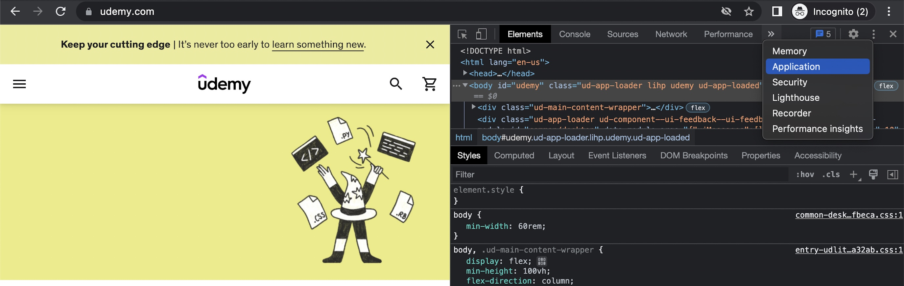
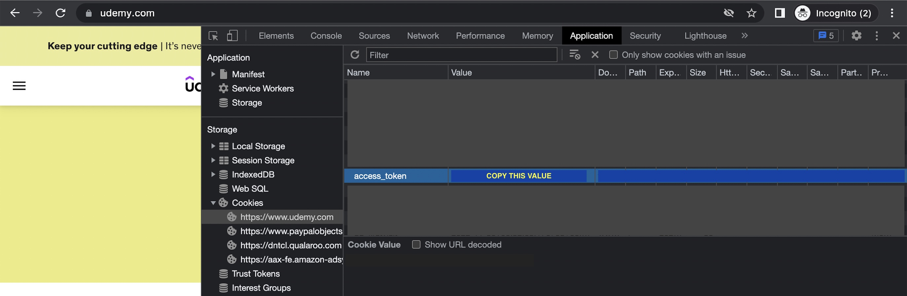

# Homework 6: Data Visualization Framework

> Team: Coding Method University  
> Shih-Hung Wang (shihhunw)  
> Yu-Su Wang (yusuwang)

## Introduction

Our framework focuses on data analysis of course information, which can be either physical or online courses. Given multiple resources of course information provided by the data plugins, the framework merges and analyzes the data before presenting the statistics in various ways with different visualization plugins.

### Data Plugins

The data plugins should provide a list of courses with some information, which may include the course name, instructors, price, hours, ratings, number of people enrolled, and reviews. The name and instructors are required while the others are optional. If an optional field is left empty, the framework will try to fill in some value based on other fields. Here are some examples of data plugins:

- CMU FCE plugin that crawls the evaluation of CMU courses from the [CMU FCE website](https://www.cmu.edu/hub/fce/).
- Pluralsight plugin that extracts the Pluralsight course information with [Pluralsight API](https://developer.pluralsight.com/).
- LinkedIn Learning plugin that takes the details of LinkedIn Learning courses with [LinkedIn Learning API](https://learn.microsoft.com/en-us/linkedin/learning/).

### Visualization Plugins

After some data processing, the framework will output a list of all courses with both given and analyzed information, which can be presented by various visualization plugins including the followings:

- Tables that filter and sort all courses based on instructors, prices, ratings, and so on.
- Distribution graphs that display the distribution of prices, hours, and ratings of all courses or some chosen ones.
- Heat maps that show the popularity of instructors based on the number of students or ratings.

## Setting up Backend Server

Run the following commands:

```
cd backend
mvn clean # remove previous artifacts
mvn compile # compile the artifacts
mvn exec:exec # execute the backend server
```

Then, the Java backend server will start at http://localhost:8080.

### Setting up Udemy Data Plugin (Optional)

The Udemy data plugin requires an access token to query course information from the Udemy APIs. By default, an access token is not provided. If you want to enable and use the Udemy data plugin, please:

1. Register an account at [Udemy](https://www.udemy.com/) and login to your account.

2. Visit the [Udemy homepage](https://www.udemy.com/) and inspect the cookies in your browser.  
   If you are using Chrome, they can be found by clicking the triple dots icon at the upper right corner -> `More Tools` -> `Developer Tools` -> `Application`.
   
   
   
   
   
3. Retrieve and copy your access token (i.e., the `access_token` value) from the cookies.  
   If you are using Chrome, it can be found under `Cookies` -> `https://www.udemy.com` -> `access_token`. Refresh the page if it doesn't show up.
   
   

4. Replace the only line (i.e., the comment) of [accessToken.txt](backend/src/main/java/edu/cmu/cs/cs214/analyzer/plugin/udemy/accessToken.txt) with your access token.  
   The first line of this file will be treated as access token when the data plugin calls Udemy APIs.

5. Rerun the steps of setting up backend server and the Udemy data plugin should now be able to fetch data from the Udemy APIs.


## Setting up Frontend Server

In another terminal, run the following commands:

```
cd frontend
npm install # install dependencies
npm start # start the frontend
```

This will start the frontend server/React app at http://localhost:3000.

## Using the Application

Open your browser and visit http://localhost:3000. Follow the instructions shown on the web page to load data and visualization plugins.

## Registering Plugins

### Data Plugins

1. Data plugins should implement the `DataPlugin` interface, defined in the `backend/src/main/java/edu/cmu/cs/cs214/analyzer/framework/core/DataPlugin.java` file.

2. Copy the plugin implementation/code under the `backend/src/main/java/edu/cmu/cs/cs214/analyzer/plugin` folder. Data plugins can have their directory and contain multiple source or configuration files. For example,

    ```bash
    ➜  backend git:(main) ✗ tree src/main/java/edu/cmu/cs/cs214/analyzer/plugin
    src/main/java/edu/cmu/cs/cs214/analyzer/plugin
    ├── ExamplePlugin.java
    ├── FCEPlugin.java
    └── udemy
        ├── UdemyPlugin.java
        └── accessToken.txt
    ```

3. Add a line containing the class name of the data plugin in the `backend/src/main/resources/META-INF/services/edu.cmu.cs.cs214.analyzer.framework.core.DataPlugin` file. For example,

    ```bash
    ➜  backend git:(main) ✗ cat src/main/resources/META-INF/services/edu.cmu.cs.cs214.analyzer.framework.core.DataPlugin
    # List of plugins to be registered by framework.
    # Provide fully qualified class names here ( edu.cmu.cs.cs214.analyzer.plugin.XXX ),
    # with one plugin per line.
    edu.cmu.cs.cs214.analyzer.plugin.FCEPlugin
    edu.cmu.cs.cs214.analyzer.plugin.udemy.UdemyPlugin
    ```

4. Restart the backend server by running `mvn exec:exec`.
5. Visit the web page, and the web page should show the new data plugin option in the plugin list.
6. To remove a data plugin, simply removing the corresponding line in the `edu.cmu.cs.cs214.analyzer.framework.core.DataPlugin` file is enough.

### Visualization Plugins

1. The application only supports visualization plugins written in Typescript, which should implement the `VisPlugin` defined in the `frontend/src/Analysis.ts` file.

2. Copy the plugin implementation/code under the `frontend/src/plugin` folder. Usually, a visualization plugin is only a single `.tsx` file. For example,

    ```bash
    ➜  frontend git:(main) ✗ tree src/plugin
    src/plugin
    ├── ExampleVisualizer.tsx
    ├── InstructorVisualizer.tsx
    └── PriceRateVisualizer.tsx
    ```

3. Add a line containing the filename of the visualization plugin in the `frontend/src/plugins.txt` file. For example,

    ```bash
    ➜  frontend git:(main) ✗ cat src/plugins.txt
    PriceRateVisualizer
    InstructorVisualizer
    ```

4. Restart the frontend server by running `npm start`.
5. Visit the web page, and the web page should show the new visualization plugin in the plugin list.
6. To remove a data plugin, simply removing the corresponding line in the `plugins.txt` file is enough.

## Developing Plugins

### Data Plugins

A data plugin should implement the following interface, defined in the `backend/src/main/java/edu/cmu/cs/cs214/analyzer/framework/core/DataPlugin.java` file:

```java
/**
 * The data plugin interface used for plugins to send their courses to the analyzer.
 */
public interface DataPlugin {
    /**
     * Returns the name of the plugin.
     * 
     * @return The name of the plugin.
     */
    String getName();

    /**
     * Retrieves the information of courses from the plugin. Data plugins have the full
     * responsibility for deciding which courses to return.
     * 
     * @return A list of courses.
     */
    ArrayList<Course> getCourses();
}
```

The exchanged data structures, i.e., `Course` and `CourseReview`, are defined in the `Course.java` and `CourseReview.java` files, respectively. Data plugins can import the class definitions by adding the following:

```java
import edu.cmu.cs.cs214.analyzer.framework.core.Course;
import edu.cmu.cs.cs214.analyzer.framework.core.CourseReview;
```

### Visualization Plugins

A visualization plugin should implement the `VisPlugin` interface, defined in the `frontend/src/Analysis.ts` file:

```typescript
/**
 * The interface of the visualization plugin object. A visualization plugin must implement an
 * object named "plugin", which complies with this interface so that the frontend can load and use
 * the plugin properly.
 *
 * @param name The name of the plugin
 * @param renderer A function that takes no arguments and returns a JSX element/React component,
 *                 which is then embedded into the web page and shown to the users on the frontend
 *                 side.
 */
interface VisPlugin {
  name: string
  renderer: () => JSX.Element
}
```

The JSX element/React component returned by a plugin's `renderer` function is directly embedded into the web page. The returned element can be, e.g., a chart, table, or graph with other elements such as dropdown menus which users can interact with.

Visualization plugins can call the APIs on the backend server to retrieve data of the analyzed courses or the instructors. The details of invoking the APIs with query parameters and the response are presented in the next section.

## Backend Server/Analyzer APIs

The backend server exposes two APIs for the frontend visualization plugins to retrieve the analyzed course or instructor information. The APIs are designed as RESTful APIs.

### Retrieving Analyzed Course Information

- Endpoint: `/courses`
- Description: Gets the analyzed course information.
- Method: `GET`
- Query parameters:
  - `name`: (optional) Only return courses with names containing the specified string.
  - `categroy`: (optional) Only return courses with a category containing the specified string.
  - `level`: (optional) Only return courses with levels containing the specified string.
  - `instructor`: (optional) Only return courses with the instructor name containing the specified string.
  - `organization`: (optional) Only return courses with the organization name containing the specified string.
  - `year`: (optional) Only return courses with the year containing the specified string.
  - `size`: (optional) Limits the number of courses returned to, at most, the specified number.
- Response
  - HTTP status code 200: Success. The returned data is in the JSON format as follows.
  - Otherwise, a server failure has occurred.
- Example Query
  ```
  /courses?name=Java&organization=CMU&size=10
  ```
  Queries the analyzed courses whose name contains the string "Java" and organization name contains "CMU", up to a maximum of 10.
- Example Response

  ```json
  {
    "courses": [
      {
        "id": 123,
        "year": 2022,
        "name": "Java development for beginners",
        "description": "...",
        "instructorNames": [
            "Instructor 1",
            "Instructor 2"
        ],
        "organizationName": "CMU",
        "category": "SCS",
        "level": "Graduate",
        "totalStudents": 94,
        "totalHours": 256.5,
        "totalWeeks": 14,
        "estimatedWorkload": 9,
        "rate": 4.99,
        "price": 8074,
        "reviews": [
          {
            "courseRate": 4.9,
            "instructorRates": [
                5,
                5
            ],
            "workloadPerWeek": 19
          }
        ]
      },
    ...
    ]
  }
  ```
    - `id` (int): The ID of the course that the data plugin specifies.
    - `year` (int): The year of the course.
    - `name` (string): The course name.
    - `description` (string): The course description.
    - `instructorNames` (string[]): An array containing the names of instructors in the course.
    - `organizationName` (string): The organization that the course belongs to.
    - `category` (string): The course category.
    - `level` (string): The course level, e.g., "Undergraduate" or "Graduate".
    - `totalStudents` (double): Total students that attended the course.
    - `totalHours` (double): Total hours of the course.
    - `totalWeeks` (int): Total weeks of the course.
    - `estimatedWorkload` (double): The **estimated** time/workload in hours that participants spent on the course.
    - `rate` (double): The overall rate of the course.
    - `price` (double): The price (in US dollars) of the course.
    - `reviews` (CourseReview[]): An array containing the reviews of the course.
      - `courseRate` (double): The course rate given by the review.
      - `instructorRates` (double[]): The instructor rate(s) given by the review.
      - `workloadPerWeek` (double); The workload in hours of the course given by the review.

### Retrieving Analyzed Instructor Information

- Endpoint: `/instructors`
- Description: Gets the analyzed instructor information.
- Method: `GET`
- Query parameters:
  - `name`: (optional) Only return instructors with names containing the specified string.
  - `course`: (optional) Only return instructors whose courses contain the specified string.
  - `organization`: (optional) Only return instructors within the organization with names containing the specified string.
  - `size`: (optional) Limits the number of instructors returned to, at most, the specified number.
- Response
  - HTTP status code 200: Success. The returned data is in the JSON format as follows.
  - Otherwise, a server failure occurred.
- Example Query
  ```
  /instructors?name=JOHN&organization=CMU&size=10
  ```
  Queries the analyzed instructor information whose name contains the string "JOHN" and belongs to the organization with a name containing "CMU", up to a maximum number of 10.
- Example Response
  ```json
  {
    "instructors": [
      {
        "name": "SOLURI, JOHN",
        "courseNum": 19,
        "courseNames": [
          "ENV HIS PEOPLE/ANIML",
          "COFFEE & CAPITALISM",
          "FOOD: HISTORY EATING",
          "HIS LATIN AMER-U.S.",
          ...
        ],
        "organizationNum": 1,
        "organizationNames": [
          "CMU"
        ],
        "totalStudents": 469,
        "rate": 2.8591176470588238
      },
      ...
    ]
  }
  ```
  - `name` (string): The name of the instructor.
  - `courseNum` (int): The number of courses the instructor taught.
  - `courseNames` (string[]): The name of the courses the instructor taught.
  - `organizationNum` (int): The number of organizations the instructor belongs to.
  - `organizationNames` (string[]): The name of the organizations the instructor belongs to.
  - `totalStudents` (int): The total number of students the instructor taught.
  - `rate` (double): The overall rate of the instructor, according to the rate of previous courses.
